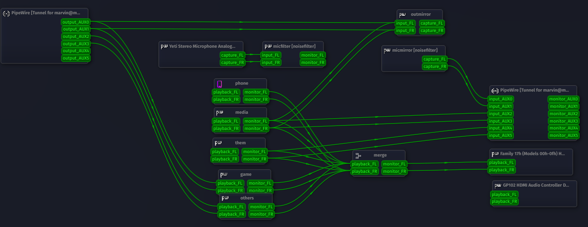

# 🎧 PipeWire Dual PC Audio Setup

This repository documents and provides scripts for a **dual-PC audio setup** using **PipeWire**, where:

* 📺 **Streaming PC** acts as the **main audio server**
* 🎮 **Gaming PC** connects to the streaming PC as a **PipeWire/PulseAudio client**

With this setup, audio from and to your streaming PC can be captured, routed, and monitored
from your main machine using native PipeWire modules.

This will give instrutions on how to replicate, 
but i recommend using this as reference for your own network setup.


---

## 🚀 Features

* Automatic detection of client/server availability via `ping`
* Uses PipeWire + PulseAudio tunnel modules for source/sink routing
* Configurable `qpwgraph` wiring for dynamic patching
* Uses a [load and save script for PipeWire connections](https://codeberg.org/marvin1099/PipewireSaveLoad)
* Persistent reconnection logic and fallback handling
* Desktop notifications for connection status
* Included **PipeWire configuration files** for all virtual devices

---

## 🖥️ System Overview

```text
Gaming PC (Client)
    PipeWire / PulseAudio
        module-tunnel-{source,sink} ◄──────┐
                                           │
Streaming PC (Server)            Network TCP (port 33478)
    PipeWire / PulseAudio                  │
        module-native-protocol-tcp  ◄──────┘
```

---

## 📂 Repository Structure

```text
.
├── pipewire-net-server.sh   # Run on the Streaming PC (server)
├── pipewire-net-server.png  # Shows my connection setup on the server
├── pipewire-net-client.sh   # Run on the Gaming PC (client)
├── pipewire-net-client.png  # Shows my connection setup on the client
└── pipewire.conf.d/         # PipeWire .conf.d files for both PCs
```

Additionally:

* [pipewire-script.py - download here](https://codeberg.org/marvin1099/PipewireSaveLoad) – Custom wiring script (used by both)
* Or disable `pipewire-script.py` in the scripts

---

## 📦 Included PipeWire Config Files

Place these in:

```bash
~/.config/pipewire/pipewire.conf.d/
```

### **Streaming PC** (all virtual devices)

* `10-media-str.conf` — Default output (e.g., videos)
* `20-them-str.conf` — Used for Discord and similar apps on the streaming PC
* `50-merge-str.conf` — Merges virtual outputs and distributes to speakers
* `60-out-str.conf` — Microphone that gets media and game audio for easy sharing to websites like vdo.ninja
* `70-denoise-str.conf` — Uses `noise-suppression-for-voice` to remove background noise from mic
* `80-game-str.conf` — Populated via TCP connection to receive game audio
* `90-others-str.conf` — Apps like Discord running on the gaming PC (via TCP connection)

### **Gaming PC** (all virtual devices)

* `10-game-gam.conf` — Main output sent over network
* `20-others-gam.conf` — Discord and similar audio sent over network
* `30-media-gam.conf` — Gets main audio from streaming PC via TCP
* `40-them-gam.conf` — Gets Discord/voice chat audio from streaming PC via TCP
* `50-merge-gam.conf` — Merges virtual outputs and distributes to speakers
* `60-out-gam.conf` — Microphone that gets media and game audio for easy sharing
* `70-mic-gam.conf` — Mirrors mic audio sent over TCP

---

## 📡 Server (Gaming PC)

Run the `pipewire-net-server.sh` script on your **gaming PC**. It will:

* Wait for PipeWire to become ready
* Detect the presence of the streaming PC on the network
* Load the `module-tunnel-{source,sink}` modules targeting the streaming PC
* Set default source/sink
* Mount volumes (Not needed usefull for smb share auto mount)
* Restore your patch graph via `qpwgraph`

📝 **Set the streaming PC IP** in the script before running.

---

## 🔌 Client (Streaming PC)

Run the `pipewire-net-client.sh` script on your **streaming PC**. It will:

* Wait for PipeWire to become active
* Wait for the gaming PC to come online
* Load `module-native-protocol-tcp` to accept incoming tunnel connections
* Automatically apply audio patches via `qpwgraph` and `pw-link`
* Set default source/sink for audio monitoring or recording

📝 **Set the gaming PC IP** in the script before running.

---

## 🔄 Automatic Wiring

* The script applies the `qpwgraph` configuration (`def.qpwgraph`)
* Afterwards it calls `pipewire-script.py -l` to load previously saved wiring setups

💡 **Note:**
`qpwgraph` alone won’t fully connect network-related cables — this is why `pipewire-script.py` is used in addition to `qpwgraph`.

---

## 🎯 6-Channel Audio Mapping (Streaming PC Perspective)

| Channels | Direction | Purpose                                    |
| -------- | --------- | ------------------------------------------ |
| 1+2      | Send      | Mic                                        |
| 3+4      | Send      | Media                                      |
| 5+6      | Send      | Them (e.g., Discord)                       |
| 1+2      | Receive   | Game audio                                 |
| 3+4      | Receive   | Other audio (e.g., Discord from gaming PC) |
| 5+6      | Receive   | Unused                                     |

---

## 🧠 Important Notes

* To replicate this setup:

  1. Place the configs in `~/.config/pipewire/pipewire.conf.d/`
  2. Run the server and client scripts
  3. Connect your virtual cables in `qpwgraph`
  4. Save the graph in `qpwgraph` and also with:

     ```bash
     pipewire-script.py -s
     ```
* You can modify the IPs if your local network uses different addresses.
* `mount -a` is used to mount any `/etc/fstab` smb shares.

---

## 📸 Screenshots

Server (Streaming PC):


Client (Gaming PC):


---

## 🧪 Troubleshooting

* Make sure firewall allows TCP port `33478` between machines.
* Ensure `pipewire-pulse` is running instead of PulseAudio.
* If `qpwgraph` crashes, try launching it manually to inspect output.
* Check module status with:

  ```bash
  pactl list short modules
  ```

